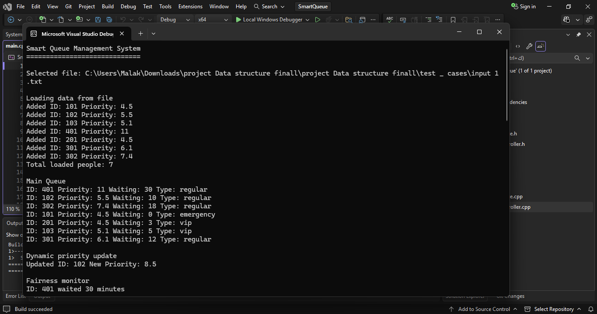
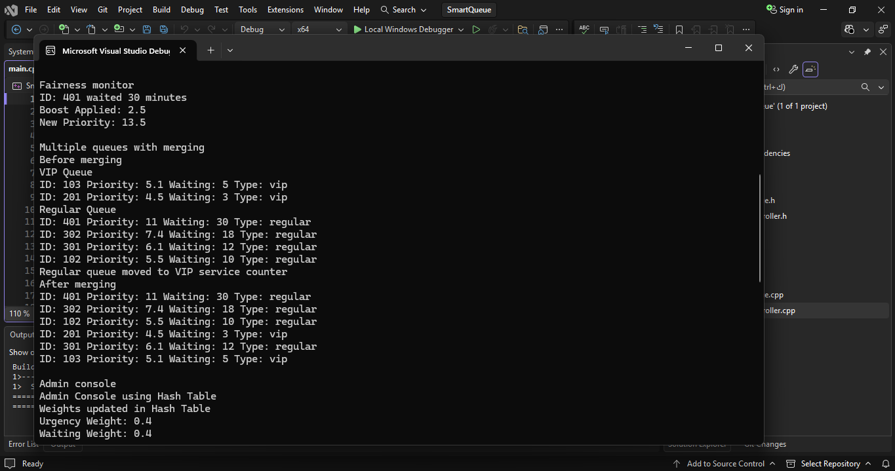

# 🚀 Smart Queue System

A powerful **C++ implementation** of a Smart Queue System using the **Priority Queue** data structure to simulate real-world queue management.

---

## 📌 Overview
This project simulates how modern systems handle queues based on **priority rather than arrival time**.

It reflects real-world applications such as:
- 🏥 Hospital triage systems  
- ☎️ Customer service centers  
- ⚙️ Task scheduling systems  

The system is designed using clean **Object-Oriented Programming (OOP)** principles with a modular architecture.

---

## ⚙️ Features

- ✅ Priority-based queue processing  
- ✅ Dynamic priority updates (real-time changes)  
- ✅ Fairness monitoring system  
- ✅ Multiple queues with merging logic  
- ✅ Simulation mode (time-based events)  
- ✅ Admin console with configurable weights  
- ✅ Advanced reporting system  

---

## 🧠 Key Concepts

- Data Structures → **Priority Queue**
- Object-Oriented Programming (OOP)
- System Design & Simulation
- Problem Solving & Optimization

---

## 🏗️ System Architecture

The system is divided into multiple components:

- **Person** → Represents each entity in the queue  
- **PriorityQueue** → Core logic for managing priorities  
- **SystemController** → Controls system flow and operations  
- **main.cpp** → Entry point  

---

## 📂 Project Structure

```
Smart-Queue-System/
│
├── main.cpp
├── Person.cpp / Person.h
├── PriorityQueue.cpp / PriorityQueue.h
├── SystemController.cpp / SystemController.h
│
├── test_cases/
│   ├── input1.txt
│   ├── input2.txt
│   └── input3.txt
│
├── Smart_Queue_Management_System_Report.pdf
├── output-simulation.png
└── README.md
```

---

## ▶️ How to Run

```bash
g++ main.cpp Person.cpp PriorityQueue.cpp SystemController.cpp -o program
./program
```

---

## 🧪 Sample Output

### 🔹 Simulation Mode


### 🔹 Queue Output

---

## 🎯 Simulation Example

The system demonstrates:

- Real-time arrivals  
- Dynamic servicing based on priority  
- Queue updates over time  
- Final reporting of served entities  

---

## 📊 Advanced Capabilities

- 🔄 Dynamic Priority Adjustment  
- ⚖️ Fairness Monitoring (waiting time handling)  
- 🔀 Multi-Queue Merging  
- 🧾 Reporting System for analysis  

---

## 📄 Documentation

For full project details and requirements:

📎 `Smart_Queue_Management_System_Report.pdf`

---

## 💡 Use Cases

- Hospital emergency systems  
- Call center management  
- Operating system scheduling  
- Service-based applications  

---

## 🏆 Highlights

- Clean and scalable architecture  
- Real-world simulation approach  
- Strong application of data structures  
- Production-like system thinking  

---

## 👩‍💻 Author

Malak
---

## ⭐ Final Note

This project goes beyond basic implementation and demonstrates how **data structures can be used to design intelligent and efficient real-world systems.**
